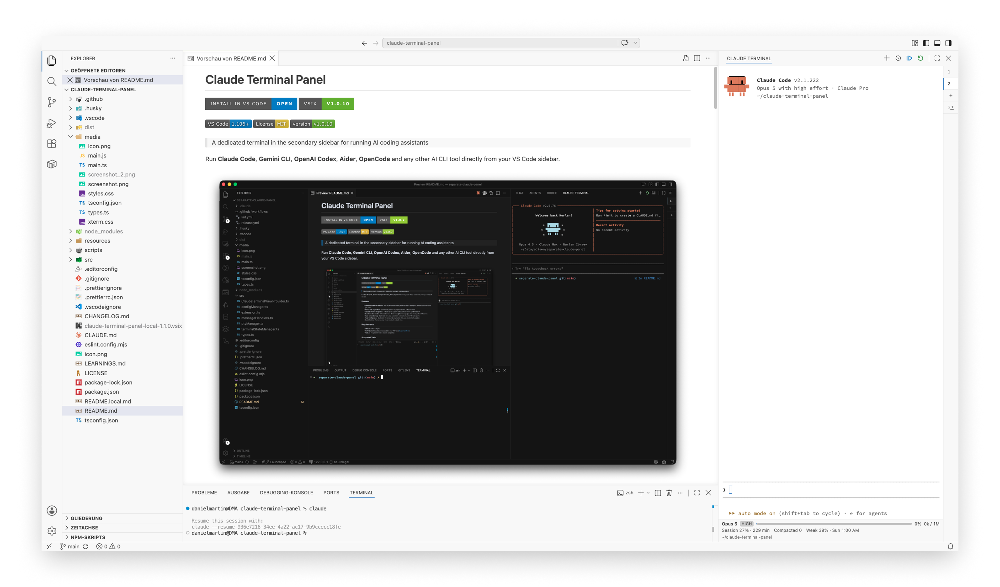

# Claude Terminal Panel (local)

> A dedicated terminal in the secondary sidebar for running AI coding assistants.

A locally maintained fork of [Nolikzero/claude-terminal-panel](https://github.com/Nolikzero/claude-terminal-panel),
rebranded to `Claude Terminal Panel (local)` and built **for this machine only** — there is no
Marketplace, no publish step, and must not be one. It is installed as
`local.claude-terminal-panel-local` so a Marketplace update can never overwrite it.

This README is the user-facing description of what the panel does and how to configure it. The
build recipe, package contents, architecture and the machine-specific setup live in
[`README.local.md`](README.local.md); tool quirks and dead ends in [`LEARNINGS.md`](LEARNINGS.md).

Run **Claude Code** and **OpenCode** directly from VS Code's secondary sidebar, in one panel, with
tabs that remember which engine they belong to.



## Features

- **Dedicated sidebar terminal** — run a CLI coding assistant in the secondary sidebar, always at
  hand while you code.
- **Two engines in one panel** — the `+` button and `New Terminal Tab` ask **Claude Code** or
  **OpenCode** before spawning; each tab remembers its engine.
- **Per-engine accent colours** — a Claude tab is Anthropic orange, an OpenCode tab violet, so the
  current engine reads at a glance.
- **Multi-tab sessions** — several terminals at once, with keyboard shortcuts to hop between them.
- **Native status line** (Claude tabs) — model, effort, context usage, rate limits and working
  directory rendered at the bottom edge as a real row instead of text in the scrollback.
- **Context threshold** — the status bar's context track carries a draggable handle; past the
  threshold it turns red and warns once, offering `/clear` in that tab.
- **Resume and continue in place** — restart the active tab with `--resume` / `--continue` without
  piling up new tabs, in the tab's own directory.
- **Editor context** — the open file sits above the status line; one click (or a shortcut) puts
  the **selected code** into the prompt, `@path` only when nothing is selected.
- **Custom commands** — create terminals with a command of your own, with flag suggestions from `--help`.
- **Working directory control** — per-tab `cwd` (`~` allowed), so Claude's session history per
  directory stays visible.
- **Theme aware** — the panel follows VS Code's light/dark theme, including the OpenCode tab, which
  is nudged to re-resolve its light/dark variant live when the system appearance flips.
- **Prompt notifications** — a pulsing indicator when the terminal is waiting for your input.
- **PATH-independent spawning** — commands resolve to absolute paths across the host PATH plus
  the user-local agent dirs, so a bare `opencode` works even from a Finder-launched VS Code.

## Requirements

- **VS Code** 1.106 or higher.
- **An AI CLI tool** on your system — `claude` and/or `opencode` (see below).
- **Node.js** for building from source only. The runtime needs no rebuild: `node-pty` 1.1.0 is
  N-API and therefore ABI-independent.

## Engines

| Engine      | Command    | Typical install                            |
| ----------- | ---------- | ------------------------------------------ |
| Claude Code | `claude`   | `npm install -g @anthropic-ai/claude-code` |
| OpenCode    | `opencode` | `brew install opencode-ai/tap/opencode`    |

Both engines share the panel's terminal behaviour — PTY spawning, multi-tab sessions, prompt
notifications, custom-command tabs. The engineered extras — native status line, `--resume` /
`--continue`, editor context — are Claude-specific; OpenCode tabs get the engine accent and live
light/dark theme switching instead.

## Usage

1. **Open the panel** — click the terminal icon in the secondary sidebar.
2. **Start an engine** — the `+` button (or `Cmd+Shift+\``) asks **Claude Code** or **OpenCode**,
   then spawns the tab. The very first tab in an empty panel spawns the configured engine directly.
3. **Interact** — prompt your assistant straight in the terminal.
4. **Add another** — `+` again, or open a custom-command tab from the CLI icon button.

### Commands

| Command                                                     | Description                                              |
| ----------------------------------------------------------- | -------------------------------------------------------- |
| `Claude Terminal: Restart Terminal`                         | Restart the session in the tab's own directory           |
| `Claude Terminal: New Terminal Tab`                         | Ask which engine, then spawn a tab                       |
| `Claude Terminal: Resume Session in Current Tab…`           | Restart tab with `--resume`, pick a session (Claude)     |
| `Claude Terminal: Continue Last Session in Current Tab`     | Restart tab with `--continue` (Claude)                   |
| `Claude Terminal: New Terminal Tab (Resume Session…)`       | Open extra tab with `--resume` (Claude)                  |
| `Claude Terminal: New Terminal Tab (Continue Last Session)` | Open extra tab with `--continue` (Claude)                |
| `Claude Terminal: Close Terminal Tab`                       | Close the current tab                                    |
| `Claude Terminal: Next Terminal Tab`                        | Switch to the next tab                                   |
| `Claude Terminal: Previous Terminal Tab`                    | Switch to the previous tab                               |
| `Claude Terminal: Add Editor Selection to Prompt`           | Put the selected code, or the open file, into the prompt |

The four session commands are Claude Code only. Claude stores its history per working directory, so
which sessions a tab offers depends on the tab's directory — shown in the tab tooltip.

### Keyboard Shortcuts

| Action                  | Windows/Linux   | macOS           |
| ----------------------- | --------------- | --------------- |
| New Tab                 | `Ctrl+Shift+\`` | `Cmd+Shift+\``  |
| Close Tab               | `Ctrl+W`        | `Cmd+W`         |
| Next Tab                | `Ctrl+PageDown` | `Cmd+Opt+Right` |
| Previous Tab            | `Ctrl+PageUp`   | `Cmd+Opt+Left`  |
| Add Selection to Prompt | `Ctrl+Alt+K`    | `Cmd+Opt+K`     |

## Configuration

Set via VS Code Settings (`Cmd+,` / `Ctrl+,`):

| Setting                                  | Type    | Default      | Description                                                                   |
| ---------------------------------------- | ------- | ------------ | ----------------------------------------------------------------------------- |
| `claudeTerminal.command`                 | string  | `"claude"`   | Command run when a Claude tab spawns                                          |
| `claudeTerminal.opencodeCommand`         | string  | `"opencode"` | Command run by an OpenCode tab picked from the new-tab menu                   |
| `claudeTerminal.args`                    | array   | `[]`         | Extra arguments for the configured command                                    |
| `claudeTerminal.autoRun`                 | boolean | `true`       | Run the command when the tab opens                                            |
| `claudeTerminal.shell`                   | string  | `""`         | Custom shell (empty = system default; used when `directMode` is off)          |
| `claudeTerminal.cwd`                     | string  | `""`         | Fixed working directory, `~` allowed (empty = first workspace folder)         |
| `claudeTerminal.env`                     | object  | `{}`         | Additional environment variables                                              |
| `claudeTerminal.directMode`              | boolean | `true`       | Run directly, no shell wrapper                                                |
| `claudeTerminal.statusLine`              | boolean | `true`       | Render Claude's native status line at the bottom of the panel                 |
| `claudeTerminal.statusLineProvider`      | string  | `"bundled"`  | `bundled` ships the producer; `own` expects your script to write the snapshot |
| `claudeTerminal.statusLineCompactBudget` | number  | `0`          | Compaction target, shown as `Compacted 1/3`; `0` shows the count alone        |
| `claudeTerminal.editorContext`           | boolean | `true`       | Show the open file above the status line (command works either way)           |
| `claudeTerminal.contextThreshold`        | number  | `60`         | Percentage of the context window at which the track turns red and warns       |
| `claudeTerminal.promptNotification`      | boolean | `true`       | Show a pulsing indicator when the terminal awaits input                       |
| `claudeTerminal.promptNotificationDelay` | number  | `300`        | ms after output stops before the indicator appears                            |
| `claudeTerminal.promptPatterns`          | array   | `[]`         | Extra regex patterns for input-prompt detection                               |

## Status Line (Claude tabs)

For Claude Code tabs the panel draws a row at its bottom edge: model and effort, a context bar with
percentage and token count, the five-hour and weekly rate limits with reset points, the compaction
count, and the working directory.

It works with no setup. Node-pty's stream does not carry model, token or rate-limit data — Claude
Code hands those only to its configured `statusLine` command — so the extension ships a small
producer and passes it to Claude per session via `--settings`. Nothing in `~/.claude/settings.json`
is changed, and the injection applies inside the panel only. An existing `statusLine` command is
still run for its side effects, with its text dropped. Set `statusLineProvider` to `own` if your
script writes the panel snapshot itself, or `statusLine` to `false` to turn the row off.

Notes:

- The row updates when Claude re-renders its status line; a value older than a minute is greyed.
- Tabs running something other than Claude Code have no status row.
- Claude's own colours (diffs, highlights) follow its `theme` setting, not the VS Code theme. On a
  light theme, pick a light one in Claude too with `/theme`.

## Editor Context

Above the status line sits the file the editor is showing — `main.ts`, or `main.ts:120-134` when
you have code selected. Clicking that row, or pressing `Cmd+Opt+K` / `Ctrl+Alt+K`, puts it into the
prompt:

- **With a selection**, the selected code goes in as a fenced block headed by `path:lines`.
- **Without one**, an at-mention of the file: `@src/main.ts`.

An at-mention makes Claude read the whole file, and the line numbers next to it are only prose —
measured on a 270-line file, 7422 bytes arrived for 120 bytes of selection. Sending the selected
lines sends the lines you meant; if Claude needs the rest it can read the file itself. Selections
beyond 8000 characters fall back to the mention, which is smaller and easier to read than the block.

The text is inserted, never submitted, and the caret moves to the terminal with it — the shortcut
is pressed with focus in your editor, so without that the next thing you type would land in the file
you were pointing at. Nothing is attached automatically: context leaves the editor only when asked
for.

## Custom Commands

Click the CLI icon button (next to `+`) to create a terminal with a custom command instead of
picking from the engine menu. Each tab remembers the engine it started with, so `Restart` and the
Resume/Continue commands reuse it rather than falling back to the configured command. OpenCode tabs
get no status line, and the Claude-only `--resume` / `--continue` flags are not applied to them.

When creating a custom terminal you are asked for the **command** and its **arguments**. As you type
the argument, the extension fetches available flags from the command's `--help` output (running
without a shell, against an allowlist) and suggests them — for Claude Code and OpenCode alike.

## Prompt Notifications

The panel can detect when a terminal is waiting for input and show a pulsing indicator on the tab.
Built-in patterns cover yes/no prompts, confirmations, interactive menus, REPL prompts and Claude
Code's plan-file prompts. Add your own with `claudeTerminal.promptPatterns`:

```json
{
  "claudeTerminal.promptPatterns": ["^mybot> $", "\\[waiting\\]", "^Input: $"]
}
```

Turn it off entirely with `claudeTerminal.promptNotification: false`.

## Development

### Prerequisites

- Node.js 20 or 22 (see [`README.local.md`](README.local.md) — Node 25 breaks `vsce` packaging).
- npm

### Setup

```bash
git clone https://github.com/clementcopper/claude-terminal-panel.git
cd claude-terminal-panel
export PATH="$HOME/.nvm/versions/node/v20.19.0/bin:$PATH"
npm ci
npm run compile
```

### Available Scripts

| Script                 | Description                |
| ---------------------- | -------------------------- |
| `npm run compile`      | Bundle extension + webview |
| `npm run watch`        | Watch-mode compile         |
| `npm run lint`         | ESLint                     |
| `npm run lint:fix`     | Fix ESLint issues          |
| `npm run format`       | Prettier write             |
| `npm run format:check` | Prettier check             |
| `npm run package`      | Build the `.vsix`          |

There is no test suite. Verification is `npm run lint && npm run compile`, optional
`npx tsc --noEmit` on both tsconfigs, then package, install and exercise the panel by hand — see
`README.local.md` for the full recipe.

## License

MIT — see [LICENSE](LICENSE). Upstream copyright (C) 2025 nolikzero; this fork keeps the original
license.

## Acknowledgments

- [xterm.js](https://xtermjs.org/) — the terminal emulator powering the UI.
- [node-pty](https://github.com/microsoft/node-pty) — native pseudoterminal support.
- [Nolikzero/claude-terminal-panel](https://github.com/Nolikzero/claude-terminal-panel) — the
  upstream project this fork is built on.
